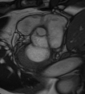
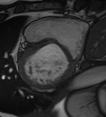
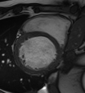
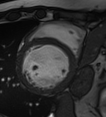
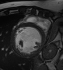

# Images and Masks

Here are some examples for masks and original images. In the first row there are the original images, the rows below show the masks.

  
  
  
  
  
  

  
  
  
  
  
    

  
  
  
  
  
    

  
  
  
  
  
  

  
  
  
  
  
  

